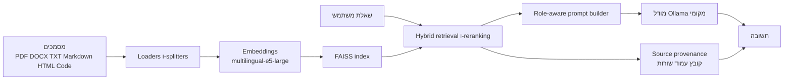

<div align="center">
<table border="0">
<tr>
<td width="140" valign="top">
  
</td>
<td valign="middle">
  <h1>LocalRAG</h1>
  <p><strong>RAG רב-לשוני בגישת local-first לשאלות על מסמכים פרטיים</strong></p>
  <p>
    <a href="Readme.md">English</a> ·
    <a href="Readme.ru.md">Русский</a> ·
    <a href="Readme.nl.md">Nederlands</a> ·
    <a href="Readme.zh.md">中文</a> ·
    <a href="Readme.he.md">עברית</a>
  </p>
  <p>
    <a href="https://github.com/Sergey360/LocalRAG"></a>
    <a href="https://ollama.com"></a>
  </p>
  <p>
    
    
    
    
    
    
    
  </p>
</td>
</tr>
</table>
</div>

LocalRAG היא אפליקציית Retrieval-Augmented Generation מקומית למענה על שאלות על קבצים פרטיים במחשב שלך. זהו פרויקט הנדסי עצמאי המתמקד במערכות AI מקומיות, חוויית משתמש רב-לשונית, איכות אחזור, יכולת הסבר ומשמעת ריליס.

## תצוגת ממשק


## למה הפרויקט הזה קיים

הרבה הדגמות RAG נראות טוב על סט נתונים נקי לדוגמה ומתפרקות על תיקיות מקומיות אמיתיות: פורמטים מעורבים, OCR רועש, תוכן רב-לשוני, שמות קבצים לא עקביים ויכולת חלשה לעקוב אחרי המקור. LocalRAG הוא ניסיון לפתור את זה בצורה כנה יותר.

הפרויקט נבנה במכוון סביב אילוצים מעשיים:

- עיבוד המסמכים נשאר מקומי
- מענה רב-לשוני הוא דרישת ליבה
- התשובות חייבות להיות מוסברות וקשורות למקור
- האחזור חייב להתמודד עם PDF כבד ב-OCR ועם קורפוס מעורב
- בדיקות ריליס צריכות למדוד איכות תשובות, לא רק אם השרת עלה

## סטאק טכנולוגי

### Backend ו-API

- `Python 3.13`
- `FastAPI`
- תבניות `Jinja2` מרונדרות בשרת
- `HTMX` endpoints לרענון חלקי של ה-UI
- `vanilla JavaScript` להתנהגות לקוח ולמצב ההגדרות

### צינור RAG

- `Ollama` לאינפרנס לוקאלי של LLM
- `FAISS` לחיפוש וקטורי מתמשך
- `intfloat/multilingual-e5-large` עבור embeddings
- `LangChain` splitters/loaders כאשר זה מתאים
- היוריסטיקות מותאמות ל-hybrid retrieval, reranking ועדיפות מקורות
- provenance עם נתיב קובץ, מספר עמוד וטווחי שורות

### שכבת מוצר ו-UX

- ממשק רב-לשוני: `English`, `Russian`, `Dutch`, `Chinese`, `Hebrew`
- הפרדה בין שפת הממשק לשפת התשובה
- תפקידי תשובה מובנים: `אנליסט`, `מהנדס`, `ארכיונאי`
- shared custom roles עם prompt, שפה, מודל, סגנון ואיור משלהם
- מנהל מודלים של Ollama ובורר תיקיית מסמכים בתוך האפליקציה

### Delivery ואיכות

- `Docker Compose`
- `pytest`
- release smoke checks
- הרצת eval מורחבת עם quality gate assertions
- `GitLab CI` עבור build ו-release checks במהלך הפיתוח
- אינטגרציה עם `Kiwi TCMS` לניהול בדיקות מובנה

## סקירת ארכיטקטורה



ברמה גבוהה הזרימה נראית כך:

1. טעינה ונרמול של קבצים מקומיים.
2. פיצול התוכן ל-chunks והוספת מטא-דאטה.
3. בניית embeddings ושמירת אינדקס FAISS.
4. שליפת chunks מועמדים בעזרת hybrid scoring.
5. הפעלת role-aware prompting וחוקי שפת תשובה.
6. החזרת התשובה יחד עם הקשר מקור מבוסס.

## מה מימשתי

הערך של הפרויקט הזה אינו רק רשימת הטכנולוגיות. החלק המעניין נמצא בפרטים.

- בניתי אפליקציית RAG מקומית רב-לשונית סביב FastAPI, Ollama ו-FAISS.
- הוספתי mapping בין host path ל-container path כך שה-UI מציג נתיבי מערכת אמיתיים בעוד Docker משתמש ב-mounts פנימיים.
- מימשתי source provenance עם נתיב קובץ, הפניות לעמודים וטווחי שורות מדויקים בפאנל ההקשר.
- הוספתי תפקידי תשובה עם master prompts ניתנים לעריכה ומערכת shared custom roles בצד השרת.
- הוספתי ברירות מחדל לכל תפקיד עבור שפת תשובה, מודל, סגנון ואיור.
- בניתי Ollama model manager ישירות בתוך ה-UI, כולל התקנה, מחיקה ובחירת ברירת מחדל בדפדפן.
- שיפרתי את איכות האחזור עבור PDF כבד ב-OCR ועבור שאילתות title/cover באמצעות hybrid scoring והיוריסטיקות source-aware.
- הוספתי eval pipeline שחוזר על עצמו ו-release quality gate במקום להסתמך רק על smoke tests.
- שילבתי את תהליך העבודה עם Kiwi TCMS לצורך בדיקות פורמליות במהלך הפיתוח.

## מיקוד הנדסי

הפרויקט הזה משקף את ה-trade-offs ההנדסיים שחשובים לי:

- `Privacy-first local AI`: המסמכים נשארים על המכונה.
- `Grounded answers`: provenance חשוב יותר מגנרציה מרשימה.
- `Multilingual product thinking`: שפת ממשק ושפת תשובה הן concerns שונים.
- `Pragmatic release discipline`: בדיקות, smoke, eval ו-quality gates כולם חשובים.
- `Real-world retrieval quality`: קורפוסים מעורבים ו-OCR לא מושלם הם אילוצים מהותיים, לא שוליים.

## עיקרי היכולות

- שאלות ותשובות מקומיות על PDF, DOCX, TXT, Markdown, HTML, JSON, CSV, YAML וקוד מקור.
- Hybrid retrieval עם source provenance, הפניות לעמודים וטווחי שורות בפאנל ההקשר.
- הפרדה בין שפת הממשק לשפת התשובה.
- תפקידי תשובה מובנים: אנליסט, מהנדס, ארכיונאי.
- role prompts ניתנים לעריכה, role artwork ו-shared custom roles בצד השרת.
- Ollama model manager מובנה בחלון ההגדרות.
- צינור אחזור ברמת ריליס, מאומת באמצעות סט eval מורחב של 30 שאלות.

## ברירת המחדל של סביבת ההרצה

ברירות המחדל הנוכחיות המכוונות לריליס:

- גרסת האפליקציה: `0.9.0`
- מודל ברירת מחדל לתשובות: `qwen3.5:9b`
- מודל embeddings: `intfloat/multilingual-e5-large`
- נתיב מסמכים ב-Windows host: `C:\Temp\PDF`
- נתיב מסמכים בתוך הקונטיינר: `/hostfs/c/Temp/PDF`
- כתובת האפליקציה: `http://localhost:7860`
- תיעוד API: `http://localhost:7860/docs`

## התחלה מהירה

### זרימת עבודה רגילה ב-Windows

1. התקן Docker Desktop.
2. שכפל את המאגר:

   ```sh
   git clone https://github.com/Sergey360/LocalRAG.git
   cd LocalRAG
   ```

3. בדוק את `.env.example`; צור `.env` רק אם צריך overrides.
4. שים את המסמכים ב-`C:\Temp\PDF`.
5. הפעל את ה-stack:

   ```sh
   docker compose up -d --build
   ```

6. או השתמש בסקריפטי ההפעלה שהם release-first כברירת מחדל:

   ```powershell
   .\start_localrag.bat
   ```

   ```bash
   ./start_localrag.sh
   ```

   מצב פיתוח מופעל במפורש:

   ```powershell
   .\start_localrag.bat dev
   ```

   ```bash
   ./start_localrag.sh dev
   ```

7. פתח את הממשק ב-`http://localhost:7860`.

### Linux או נתיב מותאם אישית

אם אינך משתמש בנתיב ברירת המחדל של Windows, הגדר את המשתנים הבאים:

- `HOST_FS_ROOT`
- `HOST_FS_MOUNT`
- `DOCS_PATH`
- `HOST_DOCS_PATH`

האפליקציה מציגה את נתיב ה-host ב-UI, בעוד שבתוך הקונטיינר נעשה שימוש בנתיב הפנימי הממופה.

## הפניה להגדרות

| משתנה | תפקיד | ברירת מחדל |
| --- | --- | --- |
| `APP_VERSION` | גרסת האפליקציה ב-UI וב-API | `0.9.0` |
| `LLM_MODEL` | מודל Ollama ברירת מחדל לתשובות | `qwen3.5:9b` |
| `EMBED_MODEL` | מודל embeddings | `intfloat/multilingual-e5-large` |
| `HOST_FS_ROOT` | שורש host שממופה לקונטיינר | `C:/` |
| `HOST_FS_MOUNT` | נקודת mount בתוך הקונטיינר | `/hostfs/c` |
| `DOCS_PATH` | נתיב המסמכים הפנימי בקונטיינר | `/hostfs/c/Temp/PDF` |
| `HOST_DOCS_PATH` | נתיב המסמכים שמוצג ב-UI | `C:\Temp\PDF` |
| `OLLAMA_BASE_URL` | כתובת Ollama שבה האפליקציה משתמשת | `http://ollama:11434` |

## איכות, בדיקות ושער Release

הרץ את חבילת הבדיקות הרגילה:

```sh
pytest -q
```

הרץ release smoke מול מופע פעיל:

```sh
python scripts/release_check.py --base-url http://localhost:7860 --expected-model qwen3.5:9b
```

הרץ eval מורחב של RAG:

```sh
python scripts/model_eval.py --base-url http://localhost:7860 --seed-file eval/rag_eval_extended.json --models qwen3.5:9b --output temp/extended_eval.json
```

בדוק את שער האיכות:

```sh
python scripts/assert_eval_gate.py --report temp/extended_eval.json --model qwen3.5:9b --min-strict 1.0 --min-loose 1.0 --min-hit-ratio 1.0
```

צינור הפיתוח כולל גם שלב live quality-gate עבור סביבת release candidate פעילה.

## נקודות קצה של API

- `GET /` — ממשק ווב
- `POST /api/ask` — שליחת שאלה
- `GET /api/status` — מצב האינדקס
- `GET /api/health` — JSON של liveness/readiness
- `GET /api/meta` — גרסה ומטא-דאטה של runtime
- `GET /api/models` — רשימת מודלים מותקנים
- `POST /api/reindex` — הפעלת אינדוקס מחדש
- `GET /docs` — Swagger UI

## קבצים חשובים בפרויקט

- `main.py` — אפליקציית FastAPI ו-web endpoints
- `app/app.py` — אחזור, אינדוקס, קריאות למודלים ולוגיקת runtime
- `web/` — templates, styles ולוגיקת frontend
- `tests/` — בדיקות API, retrieval, roles ו-eval
- `scripts/model_eval.py` — הרצת eval מורחב
- `scripts/assert_eval_gate.py` — בדיקת ספי quality לריליס
- `RELEASE.md` — checklist לשחרור והערות packaging

## רישיון

MIT

## Maintainer

Sergey360

- GitHub: <https://github.com/Sergey360/LocalRAG>
