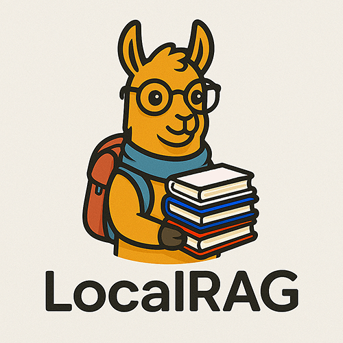
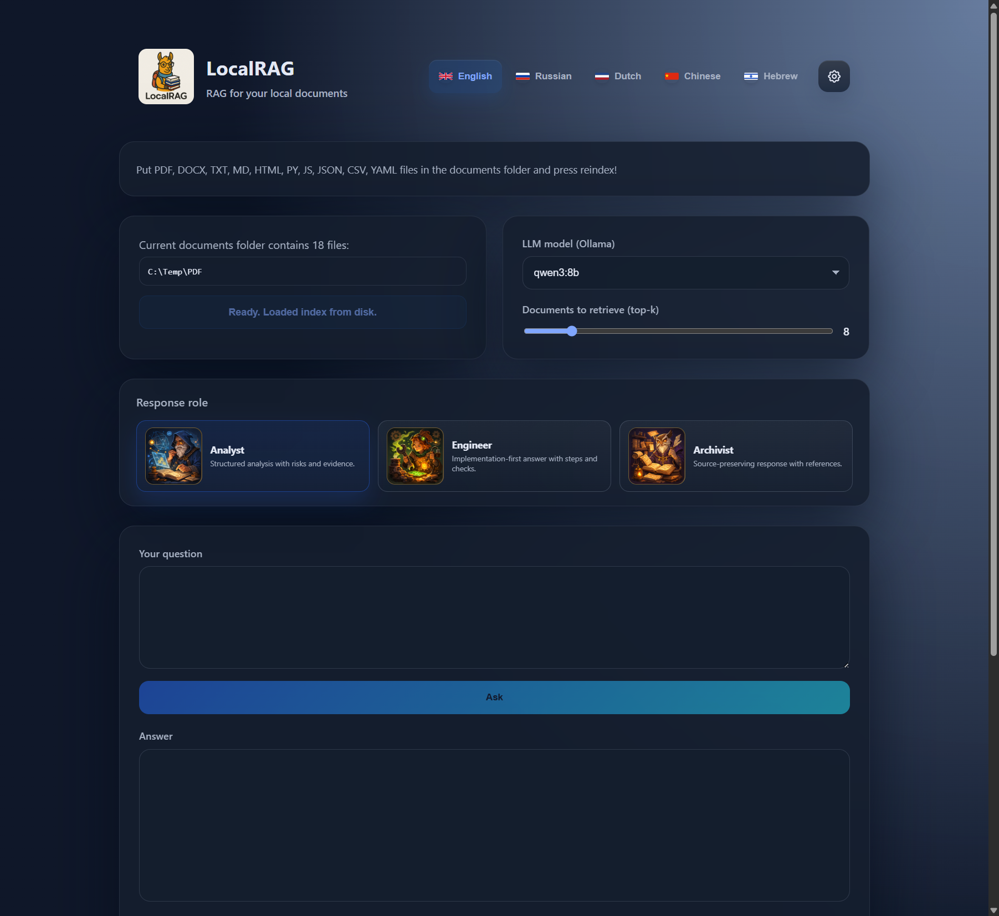
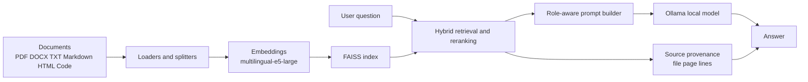

<div align="center">
<table border="0">
<tr>
<td width="140" valign="top">
  
</td>
<td valign="middle">
  <h1>LocalRAG</h1>
  <p><strong>Local-first multilingual RAG for private document question answering</strong></p>
  <p>
    <a href="Readme.md">English</a> ·
    <a href="Readme.ru.md">Русский</a> ·
    <a href="Readme.nl.md">Nederlands</a> ·
    <a href="Readme.zh.md">中文</a> ·
    <a href="Readme.he.md">עברית</a>
  </p>
  <p>
    <a href="https://github.com/Sergey360/LocalRAG"></a>
    <a href="https://ollama.com"></a>
  </p>
  <p>
    
    
    
    
    
    
    
  </p>
</td>
</tr>
</table>
</div>

LocalRAG is a local Retrieval-Augmented Generation application for answering questions over private files on your own machine. It is an independent engineering project focused on local AI systems, multilingual UX, retrieval quality, explainability, and release discipline.

## Interface Preview



## Why This Project Exists

Most RAG demos look fine on a clean sample dataset and fall apart on real local folders: mixed formats, noisy OCR, multilingual content, inconsistent filenames, and weak source traceability. LocalRAG is my attempt to solve that more honestly.

The project is intentionally built around practical constraints:

- local-only document handling
- multilingual question answering
- explainable answers with source provenance
- retrieval that can survive OCR-heavy PDFs and mixed corpora
- release checks that measure answer quality, not only whether the server starts

## Tech Stack

### Backend and API

- `Python 3.13`
- `FastAPI`
- `Jinja2` server-rendered templates
- `HTMX` endpoints for partial UI refresh
- `vanilla JavaScript` for client behavior and settings state

### RAG Pipeline

- `Ollama` for local LLM inference
- `FAISS` for persistent vector search
- `intfloat/multilingual-e5-large` for embeddings
- `LangChain` splitters/loaders where appropriate
- custom hybrid retrieval, reranking, and source-priority heuristics
- provenance with file path, page number, and line ranges

### Product and UX Layer

- multilingual UI: `English`, `Russian`, `Dutch`, `Chinese`, `Hebrew`
- separate interface language and answer language
- built-in response roles: `Analyst`, `Engineer`, `Archivist`
- shared custom roles with their own prompt, language, model, style, and artwork
- in-app Ollama model manager and documents-folder picker

### Delivery and Quality

- `Docker Compose`
- `pytest`
- release smoke checks
- extended RAG eval runner with quality gate assertions
- `GitLab CI` for build and release checks during development
- `Kiwi TCMS` integration for structured test management

## Architecture Overview



At a high level the flow is:

1. Load and normalize local files.
2. Split content into chunks and annotate metadata.
3. Build embeddings and persist a FAISS index.
4. Retrieve candidate chunks with hybrid scoring.
5. Apply role-aware prompting and answer-language rules.
6. Return the answer together with grounded source context.

## What I Implemented

The value of this project is not just the stack list. The interesting work is in the details.

- Built a multilingual local RAG application around FastAPI, Ollama, and FAISS.
- Added host-path to container-path mapping so the UI shows real system paths while Docker uses internal mounts.
- Implemented source provenance with file path, page references, and exact line ranges in the context panel.
- Added answer roles with editable master prompts and a shared server-side custom-role system.
- Added per-role defaults for answer language, model, style, and artwork.
- Built an Ollama model manager directly into the UI, including install, delete, and browser-default selection.
- Improved retrieval quality for OCR-heavy PDFs and title/cover queries using hybrid scoring and source-aware heuristics.
- Added a repeatable eval pipeline and a release quality gate instead of relying only on smoke tests.
- Integrated the workflow with Kiwi TCMS for formalized testing during development.

## Engineering Focus

This project reflects the engineering tradeoffs I care about:

- `Privacy-first local AI`: documents stay on the machine.
- `Grounded answers`: provenance matters more than flashy generation.
- `Multilingual product thinking`: UI language and answer language are separate concerns.
- `Pragmatic release discipline`: tests, smoke, eval, and quality gates all matter.
- `Real-world retrieval quality`: mixed corpora and imperfect OCR are first-class constraints, not edge cases.

## Highlights

- Local Q&A over PDF, DOCX, TXT, Markdown, HTML, JSON, CSV, YAML, and source code files.
- Hybrid retrieval with source provenance, page references, and line ranges in the context panel.
- Separate interface language and answer language.
- Built-in answer roles: Analyst, Engineer, Archivist.
- Editable role prompts, role artwork, and server-side shared custom roles.
- Built-in Ollama model manager in the settings dialog.
- Release-quality retrieval pipeline validated by an extended 30-question eval set.

## Default Runtime for This Project

Current release-oriented defaults:

- App version: `0.9.0`
- Default answer model: `qwen3.5:9b`
- Embedding model: `intfloat/multilingual-e5-large`
- Windows host documents path: `C:\Temp\PDF`
- Container documents path: `/hostfs/c/Temp/PDF`
- App URL: `http://localhost:7860`
- API docs: `http://localhost:7860/docs`

## Quick Start

### Windows default flow

1. Install Docker Desktop.
2. Clone the repository:

   ```sh
   git clone https://github.com/Sergey360/LocalRAG.git
   cd LocalRAG
   ```

3. Review `.env.example` and create `.env` only if you need overrides.
4. Put your documents into `C:\Temp\PDF`.
5. Start the stack:

   ```sh
   docker compose up -d --build
   ```

6. Or use the release-first start scripts:

   ```powershell
   .\start_localrag.bat
   ```

   ```bash
   ./start_localrag.sh
   ```

   Development mode is explicit:

   ```powershell
   .\start_localrag.bat dev
   ```

   ```bash
   ./start_localrag.sh dev
   ```

7. Open the UI at `http://localhost:7860`.

### Linux or non-default path

If you are not using the Windows default path, adjust these variables:

- `HOST_FS_ROOT`
- `HOST_FS_MOUNT`
- `DOCS_PATH`
- `HOST_DOCS_PATH`

The app displays the host path in the UI, while the container uses the mapped internal path.

## Configuration Reference

| Variable | Purpose | Default |
| --- | --- | --- |
| `APP_VERSION` | Application version shown in UI and API | `0.9.0` |
| `LLM_MODEL` | Default Ollama model for answers | `qwen3.5:9b` |
| `EMBED_MODEL` | Embedding model | `intfloat/multilingual-e5-large` |
| `HOST_FS_ROOT` | Host root mounted into the container | `C:/` |
| `HOST_FS_MOUNT` | Mount point inside the container | `/hostfs/c` |
| `DOCS_PATH` | Internal container documents path | `/hostfs/c/Temp/PDF` |
| `HOST_DOCS_PATH` | Host documents path shown in UI | `C:\Temp\PDF` |
| `OLLAMA_BASE_URL` | Ollama endpoint used by the app | `http://ollama:11434` |

## Quality, Tests, and Release Gate

Run the regular test suite:

```sh
pytest -q
```

Run release smoke against a running stack:

```sh
python scripts/release_check.py --base-url http://localhost:7860 --expected-model qwen3.5:9b
```

Run the extended RAG eval:

```sh
python scripts/model_eval.py --base-url http://localhost:7860 --seed-file eval/rag_eval_extended.json --models qwen3.5:9b --output temp/extended_eval.json
```

Assert the quality gate:

```sh
python scripts/assert_eval_gate.py --report temp/extended_eval.json --model qwen3.5:9b --min-strict 1.0 --min-loose 1.0 --min-hit-ratio 1.0
```

The development pipeline also includes a live quality-gate step for a running release candidate environment.

## API Endpoints

- `GET /` — web interface
- `POST /api/ask` — ask a question
- `GET /api/status` — index status
- `GET /api/health` — liveness and readiness JSON
- `GET /api/meta` — version and runtime metadata
- `GET /api/models` — installed model list
- `POST /api/reindex` — trigger reindex
- `GET /docs` — Swagger UI

## Project Files Worth Knowing

- `main.py` — FastAPI app and web endpoints
- `app/app.py` — retrieval, indexing, model calls, and runtime logic
- `web/` — templates, styles, and frontend logic
- `tests/` — API, retrieval, role, and eval-related tests
- `scripts/model_eval.py` — extended eval runner
- `scripts/assert_eval_gate.py` — release quality threshold checker
- `RELEASE.md` — release checklist and packaging notes

## License

MIT

## Maintainer

Sergey360

- GitHub: <https://github.com/Sergey360/LocalRAG>


