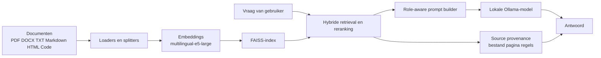

<div align="center">
<table border="0">
<tr>
<td width="140" valign="top">
  
</td>
<td valign="middle">
  <h1>LocalRAG</h1>
  <p><strong>Local-first meertalige RAG voor vraagbeantwoording over privé-documenten</strong></p>
  <p>
    <a href="Readme.md">English</a> ·
    <a href="Readme.ru.md">Русский</a> ·
    <a href="Readme.nl.md">Nederlands</a> ·
    <a href="Readme.zh.md">中文</a> ·
    <a href="Readme.he.md">עברית</a>
  </p>
  <p>
    <a href="https://github.com/Sergey360/LocalRAG"></a>
    <a href="https://ollama.com"></a>
  </p>
  <p>
    
    
    
    
    
    
    
  </p>
</td>
</tr>
</table>
</div>

LocalRAG is een lokale Retrieval-Augmented Generation-applicatie voor het beantwoorden van vragen over privébestanden op je eigen machine. Het is een onafhankelijk engineeringproject gericht op lokale AI-systemen, meertalige UX, retrievalkwaliteit, uitlegbaarheid en release-discipline.

## Interfacevoorbeeld


## Waarom Dit Project Bestaat

Veel RAG-demo's zien er goed uit op een schone voorbeelddataset en vallen uit elkaar op echte lokale mappen: gemengde formaten, rommelige OCR, meertalige inhoud, inconsistente bestandsnamen en zwakke brontraceerbaarheid. LocalRAG is mijn poging om dat eerlijker op te lossen.

Het project is bewust gebouwd rond praktische beperkingen:

- documentverwerking blijft lokaal
- meertalige vraagbeantwoording is een kernvereiste
- antwoorden moeten uitlegbaar zijn en aan bronnen gekoppeld blijven
- retrieval moet OCR-zware PDF's en gemengde corpora aankunnen
- release-checks moeten antwoordkwaliteit meten, niet alleen of de server start

## Tech Stack

### Backend en API

- `Python 3.13`
- `FastAPI`
- server-gerenderde `Jinja2`-templates
- `HTMX`-endpoints voor gedeeltelijke UI-verversing
- `vanilla JavaScript` voor clientgedrag en instellingenstatus

### RAG-Pipeline

- `Ollama` voor lokale LLM-inferentie
- `FAISS` voor persistente vectorzoekopslag
- `intfloat/multilingual-e5-large` voor embeddings
- `LangChain` splitters/loaders waar dat zinvol is
- eigen heuristieken voor hybride retrieval, reranking en bronprioriteit
- provenance met bestandspad, paginanummer en regelnummers

### Product- en UX-Laag

- meertalige UI: `English`, `Russian`, `Dutch`, `Chinese`, `Hebrew`
- gescheiden taal voor interface en antwoord
- ingebouwde antwoordrollen: `Analist`, `Engineer`, `Archivaris`
- shared custom roles met eigen prompt, taal, model, stijl en illustratie
- ingebouwde Ollama model manager en documentenmapkiezer

### Delivery en Kwaliteit

- `Docker Compose`
- `pytest`
- release smoke checks
- uitgebreide RAG-eval runner met quality gate assertions
- `GitLab CI` voor build- en releasechecks tijdens ontwikkeling
- `Kiwi TCMS`-integratie voor gestructureerd testbeheer

## Architectuuroverzicht



Op hoog niveau werkt de flow zo:

1. Lokale bestanden laden en normaliseren.
2. Inhoud in chunks splitsen en metadata toevoegen.
3. Embeddings bouwen en een FAISS-index opslaan.
4. Kandidaat-chunks ophalen met hybride scoring.
5. Role-aware prompting en antwoordtaalregels toepassen.
6. Het antwoord teruggeven samen met herleidbare broncontext.

## Wat Ik Heb Geïmplementeerd

De waarde van dit project zit niet alleen in de stacklijst. Het interessante werk zit in de details.

- Een meertalige lokale RAG-app gebouwd rond FastAPI, Ollama en FAISS.
- Hostpad-naar-containerpad-mapping toegevoegd zodat de UI echte systeempaden toont terwijl Docker interne mounts gebruikt.
- Source provenance geïmplementeerd met bestandspad, paginareferenties en exacte regelnummers in het contextpaneel.
- Antwoordrollen toegevoegd met bewerkbare master prompts en een gedeeld server-side custom-role-systeem.
- Per rol standaardinstellingen toegevoegd voor antwoordtaal, model, stijl en illustratie.
- Een Ollama model manager direct in de UI gebouwd, inclusief installeren, verwijderen en browser-default selectie.
- Retrievalkwaliteit verbeterd voor OCR-zware PDF's en title/cover-vragen via hybride scoring en source-aware heuristieken.
- Een herhaalbare eval-pipeline en een release quality gate toegevoegd in plaats van alleen smoke-tests.
- De workflow geïntegreerd met Kiwi TCMS voor geformaliseerd testen tijdens ontwikkeling.

## Engineeringfocus

Dit project weerspiegelt de engineering trade-offs die ik belangrijk vind:

- `Privacy-first local AI`: documenten blijven op de machine.
- `Grounded answers`: provenance is belangrijker dan flitsende generatie.
- `Multilingual product thinking`: interface- en antwoordtaal zijn verschillende concerns.
- `Pragmatic release discipline`: tests, smoke, eval en quality gates doen er allemaal toe.
- `Real-world retrieval quality`: gemengde corpora en imperfecte OCR zijn eerste-klas beperkingen, geen bijzaken.

## Hoogtepunten

- Lokale Q&A over PDF, DOCX, TXT, Markdown, HTML, JSON, CSV, YAML en broncodebestanden.
- Hybride retrieval met source provenance, paginareferenties en regelnummers in het contextvenster.
- Gescheiden interface- en antwoordtaal.
- Ingebouwde antwoordrollen: Analist, Engineer, Archivaris.
- Bewerkbare role prompts, role artwork en server-side shared custom roles.
- Ingebouwde Ollama model manager in het instellingenvenster.
- Release-waardige retrievalpipeline gevalideerd met een uitgebreide eval-set van 30 vragen.

## Standaard Runtime Voor Dit Project

Huidige releasegerichte defaults:

- App-versie: `0.9.0`
- Standaard antwoordmodel: `qwen3.5:9b`
- Embedding-model: `intfloat/multilingual-e5-large`
- Windows host-documentpad: `C:\Temp\PDF`
- Container-documentpad: `/hostfs/c/Temp/PDF`
- App-URL: `http://localhost:7860`
- API-docs: `http://localhost:7860/docs`

## Snelle Start

### Standaard Windows-Flow

1. Installeer Docker Desktop.
2. Clone de repository:

   ```sh
   git clone https://github.com/Sergey360/LocalRAG.git
   cd LocalRAG
   ```

3. Controleer `.env.example`; maak alleen een `.env` aan als je overrides nodig hebt.
4. Plaats je documenten in `C:\Temp\PDF`.
5. Start de stack:

   ```sh
   docker compose up -d --build
   ```

6. Of gebruik de release-first startscripts:

   ```powershell
   .\start_localrag.bat
   ```

   ```bash
   ./start_localrag.sh
   ```

   Development mode zet je expliciet aan:

   ```powershell
   .\start_localrag.bat dev
   ```

   ```bash
   ./start_localrag.sh dev
   ```

7. Open de UI op `http://localhost:7860`.

### Linux of Een Aangepast Pad

Als je niet het standaard Windows-pad gebruikt, pas dan deze variabelen aan:

- `HOST_FS_ROOT`
- `HOST_FS_MOUNT`
- `DOCS_PATH`
- `HOST_DOCS_PATH`

De app toont het hostpad in de UI, terwijl de container het gemapte interne pad gebruikt.

## Configuratiereferentie

| Variabele | Doel | Standaard |
| --- | --- | --- |
| `APP_VERSION` | Applicatieversie in UI en API | `0.9.0` |
| `LLM_MODEL` | Standaard Ollama-model voor antwoorden | `qwen3.5:9b` |
| `EMBED_MODEL` | Embedding-model | `intfloat/multilingual-e5-large` |
| `HOST_FS_ROOT` | Host-root die in de container wordt gemount | `C:/` |
| `HOST_FS_MOUNT` | Mountpoint in de container | `/hostfs/c` |
| `DOCS_PATH` | Intern containerpad voor documenten | `/hostfs/c/Temp/PDF` |
| `HOST_DOCS_PATH` | Hostpad dat in de UI wordt getoond | `C:\Temp\PDF` |
| `OLLAMA_BASE_URL` | Ollama-endpoint dat door de app wordt gebruikt | `http://ollama:11434` |

## Kwaliteit, Tests en Release Gate

Draai de reguliere testsuite:

```sh
pytest -q
```

Draai release smoke tegen een actieve stack:

```sh
python scripts/release_check.py --base-url http://localhost:7860 --expected-model qwen3.5:9b
```

Draai de uitgebreide RAG-eval:

```sh
python scripts/model_eval.py --base-url http://localhost:7860 --seed-file eval/rag_eval_extended.json --models qwen3.5:9b --output temp/extended_eval.json
```

Controleer de quality gate:

```sh
python scripts/assert_eval_gate.py --report temp/extended_eval.json --model qwen3.5:9b --min-strict 1.0 --min-loose 1.0 --min-hit-ratio 1.0
```

De ontwikkelpipeline bevat ook een live quality-gate-stap voor een draaiende release candidate-omgeving.

## API-Endpoints

- `GET /` — webinterface
- `POST /api/ask` — stel een vraag
- `GET /api/status` — indexstatus
- `GET /api/health` — liveness- en readiness-JSON
- `GET /api/meta` — versie en runtime-metadata
- `GET /api/models` — lijst met geïnstalleerde modellen
- `POST /api/reindex` — start herindexering
- `GET /docs` — Swagger UI

## Belangrijke Projectbestanden

- `main.py` — FastAPI-app en web-endpoints
- `app/app.py` — retrieval, indexering, modelaanroepen en runtime-logica
- `web/` — templates, stijlen en frontend-logica
- `tests/` — API-, retrieval-, role- en eval-gerelateerde tests
- `scripts/model_eval.py` — runner voor uitgebreide eval
- `scripts/assert_eval_gate.py` — checker voor releasekwaliteitsdrempels
- `RELEASE.md` — release-checklist en packaging-notities

## Licentie

MIT

## Maintainer

Sergey360

- GitHub: <https://github.com/Sergey360/LocalRAG>
