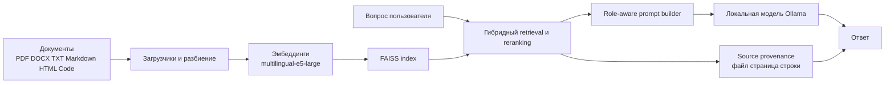

<div align="center">
<table border="0">
<tr>
<td width="140" valign="top">
  
</td>
<td valign="middle">
  <h1>LocalRAG</h1>
  <p><strong>Локальный мультиязычный RAG для вопросов по приватным документам</strong></p>
  <p>
    <a href="Readme.md">English</a> ·
    <a href="Readme.ru.md">Русский</a> ·
    <a href="Readme.nl.md">Nederlands</a> ·
    <a href="Readme.zh.md">中文</a> ·
    <a href="Readme.he.md">עברית</a>
  </p>
  <p>
    <a href="https://github.com/Sergey360/LocalRAG"></a>
    <a href="https://ollama.com"></a>
  </p>
  <p>
    
    
    
    
    
    
    
  </p>
</td>
</tr>
</table>
</div>

LocalRAG — это локальное приложение Retrieval-Augmented Generation для ответов по приватным файлам на вашем компьютере. Это независимый инженерный проект, сфокусированный на локальных AI-системах, мультиязычном UX, качестве retrieval, прозрачности ответов и инженерной дисциплине релизов.

## Предпросмотр Интерфейса


## Зачем Нужен Проект

Многие RAG-демо выглядят хорошо только на чистом игрушечном наборе данных и разваливаются на реальных локальных папках: смешанные форматы, шумный OCR, мультиязычный контент, непоследовательные имена файлов и слабая трассировка источников. LocalRAG — попытка решить эту задачу честно.

Проект намеренно строится вокруг практических ограничений:

- документы обрабатываются только локально
- вопросы и ответы поддерживают несколько языков
- ответы должны быть объяснимыми и привязанными к источнику
- retrieval должен выдерживать OCR-heavy PDF и смешанный корпус
- релизные проверки должны измерять качество ответа, а не только запуск сервера

## Технологический Стек

### Backend и API

- `Python 3.13`
- `FastAPI`
- серверные шаблоны `Jinja2`
- `HTMX` endpoints для частичного обновления UI
- `vanilla JavaScript` для клиентской логики и состояния настроек

### RAG-Конвейер

- `Ollama` для локального LLM inference
- `FAISS` для персистентного векторного поиска
- `intfloat/multilingual-e5-large` для эмбеддингов
- `LangChain` splitters/loaders там, где это уместно
- собственные эвристики hybrid retrieval, reranking и source-priority
- provenance с указанием файла, страницы и диапазонов строк

### Продуктовый и UX-Слой

- мультиязычный UI: `English`, `Russian`, `Dutch`, `Chinese`, `Hebrew`
- разделение языка интерфейса и языка ответа
- встроенные роли ответа: `Аналитик`, `Инженер`, `Архивариус`
- shared custom roles со своими prompt, языком, моделью, стилем и иллюстрацией
- встроенный менеджер моделей Ollama и выбор папки документов

### Поставка и Качество

- `Docker Compose`
- `pytest`
- release smoke checks
- расширенный RAG eval runner с quality gate
- `GitLab CI` для build и release checks в процессе разработки
- интеграция с `Kiwi TCMS` для структурированного тест-менеджмента

## Обзор Архитектуры



На верхнем уровне поток выглядит так:

1. Загрузить и нормализовать локальные файлы.
2. Разбить содержимое на чанки и дополнить метаданными.
3. Построить эмбеддинги и сохранить индекс FAISS.
4. Найти кандидатные чанки через hybrid scoring.
5. Применить role-aware prompting и правила языка ответа.
6. Вернуть ответ вместе с привязанным к источнику контекстом.

## Что Именно Реализовано

Ценность проекта не в самом списке технологий, а в инженерных деталях.

- Построено мультиязычное локальное RAG-приложение на FastAPI, Ollama и FAISS.
- Добавлен mapping host path -> container path, чтобы UI показывал реальный системный путь, а Docker использовал внутренний mount.
- Реализован source provenance с указанием файла, страницы и точных диапазонов строк в панели контекста.
- Добавлены роли ответа с редактируемыми master prompt и shared server-side custom roles.
- Добавлены per-role defaults для языка ответа, модели, стиля и иллюстрации.
- Менеджер моделей Ollama встроен прямо в UI: установка, удаление и browser-default selection.
- Улучшено качество retrieval для OCR-heavy PDF и title/cover запросов через hybrid scoring и source-aware heuristics.
- Добавлен воспроизводимый eval pipeline и release quality gate вместо одних только smoke-тестов.
- Рабочий процесс интегрирован с Kiwi TCMS для формализованного тестирования в ходе разработки.

## Инженерный Фокус

Этот проект отражает инженерные компромиссы, которые для меня важны:

- `Privacy-first local AI`: документы остаются на машине.
- `Grounded answers`: provenance важнее, чем эффектная генерация.
- `Multilingual product thinking`: язык интерфейса и язык ответа — разные сущности.
- `Pragmatic release discipline`: важны тесты, smoke, eval и quality gates.
- `Real-world retrieval quality`: смешанный корпус и несовершенный OCR — это базовое ограничение, а не edge case.

## Ключевые Возможности

- Локальный Q&A по PDF, DOCX, TXT, Markdown, HTML, JSON, CSV, YAML и исходному коду.
- Гибридный retrieval с provenance, page references и line ranges в панели контекста.
- Раздельные язык интерфейса и язык ответа.
- Встроенные роли ответа: Аналитик, Инженер, Архивариус.
- Редактируемые role prompts, role artwork и server-side shared custom roles.
- Встроенный менеджер моделей Ollama в окне настроек.
- Retrieval-пайплайн уровня релиза, проверенный расширенным eval-набором из 30 вопросов.

## Базовый Runtime Проекта

Текущие release-oriented defaults:

- Версия приложения: `0.9.0`
- Модель ответа по умолчанию: `qwen3.5:9b`
- Модель эмбеддингов: `intfloat/multilingual-e5-large`
- Хостовый путь к документам для Windows: `C:\Temp\PDF`
- Путь к документам внутри контейнера: `/hostfs/c/Temp/PDF`
- URL приложения: `http://localhost:7860`
- API docs: `http://localhost:7860/docs`

## Быстрый Старт

### Стандартный Сценарий Для Windows

1. Установите Docker Desktop.
2. Клонируйте репозиторий:

   ```sh
   git clone https://github.com/Sergey360/LocalRAG.git
   cd LocalRAG
   ```

3. Проверьте `.env.example`; создавайте `.env` только если нужны overrides.
4. Положите документы в `C:\Temp\PDF`.
5. Запустите стек:

   ```sh
   docker compose up -d --build
   ```

6. Или используйте release-first стартовые скрипты:

   ```powershell
   .\start_localrag.bat
   ```

   ```bash
   ./start_localrag.sh
   ```

   Режим разработки включается явно:

   ```powershell
   .\start_localrag.bat dev
   ```

   ```bash
   ./start_localrag.sh dev
   ```

7. Откройте UI: `http://localhost:7860`.

### Linux Или Нестандартный Путь

Если вы не используете путь по умолчанию для Windows, настройте:

- `HOST_FS_ROOT`
- `HOST_FS_MOUNT`
- `DOCS_PATH`
- `HOST_DOCS_PATH`

В интерфейсе показывается хостовый путь, а внутри контейнера используется внутренний mapping path.

## Основные Переменные Окружения

| Переменная | Назначение | Значение по умолчанию |
| --- | --- | --- |
| `APP_VERSION` | Версия приложения в UI и API | `0.9.0` |
| `LLM_MODEL` | Модель Ollama для ответов | `qwen3.5:9b` |
| `EMBED_MODEL` | Модель эмбеддингов | `intfloat/multilingual-e5-large` |
| `HOST_FS_ROOT` | Корень хоста, монтируемый в контейнер | `C:/` |
| `HOST_FS_MOUNT` | Точка монтирования внутри контейнера | `/hostfs/c` |
| `DOCS_PATH` | Внутренний путь к документам | `/hostfs/c/Temp/PDF` |
| `HOST_DOCS_PATH` | Хостовый путь, показываемый в UI | `C:\Temp\PDF` |
| `OLLAMA_BASE_URL` | Адрес Ollama для приложения | `http://ollama:11434` |

## Качество, Тесты и Release Gate

Запуск обычного тестового набора:

```sh
pytest -q
```

Проверка release smoke на запущенном стеке:

```sh
python scripts/release_check.py --base-url http://localhost:7860 --expected-model qwen3.5:9b
```

Запуск расширенного RAG eval:

```sh
python scripts/model_eval.py --base-url http://localhost:7860 --seed-file eval/rag_eval_extended.json --models qwen3.5:9b --output temp/extended_eval.json
```

Проверка quality gate:

```sh
python scripts/assert_eval_gate.py --report temp/extended_eval.json --model qwen3.5:9b --min-strict 1.0 --min-loose 1.0 --min-hit-ratio 1.0
```

В development pipeline также есть live quality-gate шаг для уже поднятого release candidate environment.

## API-Эндпоинты

- `GET /` — web interface
- `POST /api/ask` — задать вопрос
- `GET /api/status` — статус индекса
- `GET /api/health` — JSON liveness/readiness
- `GET /api/meta` — версия и runtime metadata
- `GET /api/models` — список установленных моделей
- `POST /api/reindex` — запустить переиндексацию
- `GET /docs` — Swagger UI

## Полезные Файлы Проекта

- `main.py` — FastAPI-приложение и web endpoints
- `app/app.py` — retrieval, индексация, model calls и runtime logic
- `web/` — шаблоны, стили и frontend logic
- `tests/` — API, retrieval, role и eval-related tests
- `scripts/model_eval.py` — runner для расширенного eval
- `scripts/assert_eval_gate.py` — проверка release quality threshold
- `RELEASE.md` — release checklist и packaging notes

## Лицензия

MIT

## Maintainer

Sergey360

- GitHub: <https://github.com/Sergey360/LocalRAG>
