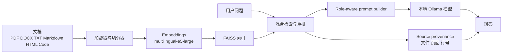

<div align="center">
<table border="0">
<tr>
<td width="140" valign="top">
  
</td>
<td valign="middle">
  <h1>LocalRAG</h1>
  <p><strong>面向私有文档问答的本地优先多语言 RAG</strong></p>
  <p>
    <a href="Readme.md">English</a> ·
    <a href="Readme.ru.md">Русский</a> ·
    <a href="Readme.nl.md">Nederlands</a> ·
    <a href="Readme.zh.md">中文</a> ·
    <a href="Readme.he.md">עברית</a>
  </p>
  <p>
    <a href="https://github.com/Sergey360/LocalRAG"></a>
    <a href="https://ollama.com"></a>
  </p>
  <p>
    
    
    
    
    
    
    
  </p>
</td>
</tr>
</table>
</div>

LocalRAG 是一个本地 Retrieval-Augmented Generation 应用，用于在你自己的电脑上针对私有文件进行问答。它也是一个独立的工程项目，重点在于本地 AI 系统、多语言 UX、检索质量、可解释性以及发布流程纪律。

## 界面预览


## 为什么要做这个项目

很多 RAG 演示在干净的示例数据集上看起来不错，但面对真实的本地文件夹就会失效：格式混杂、OCR 噪声、多语言内容、文件名不统一，以及来源追踪能力不足。LocalRAG 的目标就是更诚实地解决这些问题。

项目从一开始就围绕这些实际约束来设计：

- 文档只在本地处理
- 多语言问答是核心需求
- 回答必须可解释并能追溯到来源
- 检索必须能应对 OCR 较重的 PDF 和混合语料
- 发布检查要衡量答案质量，而不仅仅是服务能否启动

## 技术栈

### 后端与 API

- `Python 3.13`
- `FastAPI`
- 服务端渲染的 `Jinja2` 模板
- 用于局部界面刷新的 `HTMX` endpoints
- 用于前端行为和设置状态的 `vanilla JavaScript`

### RAG 管线

- `Ollama` 用于本地 LLM 推理
- `FAISS` 用于持久化向量搜索
- `intfloat/multilingual-e5-large` 用于 embeddings
- 在合适场景下使用 `LangChain` splitters/loaders
- 自定义的混合检索、重排和来源优先级启发式
- 包含文件路径、页码和行号范围的 provenance

### 产品与 UX 层

- 多语言 UI：`English`、`Russian`、`Dutch`、`Chinese`、`Hebrew`
- 将界面语言与回答语言分离
- 内置回答角色：`分析师`、`工程师`、`档案员`
- 共享自定义角色支持独立 prompt、语言、模型、风格和插图
- 内置 Ollama 模型管理器与文档文件夹选择器

### 交付与质量

- `Docker Compose`
- `pytest`
- release smoke checks
- 带 quality gate 断言的扩展 RAG eval runner
- `GitLab CI` 用于开发阶段的构建和发布检查
- 集成 `Kiwi TCMS` 进行结构化测试管理

## 架构概览



高层流程如下：

1. 加载并规范化本地文件。
2. 将内容切分为块并附加元数据。
3. 生成 embeddings 并持久化 FAISS 索引。
4. 通过混合评分检索候选块。
5. 应用基于角色的提示构建和回答语言规则。
6. 返回回答以及可追溯的来源上下文。

## 我实现了什么

这个项目的价值不只是技术栈本身，更在于工程细节。

- 基于 FastAPI、Ollama 和 FAISS 构建了一个多语言本地 RAG 应用。
- 增加了 host path 到 container path 的映射，使 UI 展示真实系统路径，而 Docker 使用内部挂载路径。
- 在上下文面板中实现了包含文件路径、页码和精确行号范围的 source provenance。
- 增加了回答角色系统，支持可编辑的 master prompt 和服务端共享自定义角色。
- 为每个角色增加了回答语言、模型、风格和插图等默认值。
- 直接在 UI 中集成了 Ollama 模型管理器，支持安装、删除和浏览器默认模型选择。
- 通过混合评分和 source-aware 启发式提升了 OCR-heavy PDF 以及 title/cover 查询的检索质量。
- 增加了可重复运行的 eval pipeline 和 release quality gate，而不是只依赖 smoke tests。
- 将开发流程接入 Kiwi TCMS，用于正式化测试管理。

## 工程关注点

这个项目体现了我重视的工程取舍：

- `Privacy-first local AI`：文档留在本机。
- `Grounded answers`：来源可追溯比炫目的生成更重要。
- `Multilingual product thinking`：界面语言和回答语言是两个不同层面。
- `Pragmatic release discipline`：测试、smoke、eval 和 quality gate 都重要。
- `Real-world retrieval quality`：混合语料和不完美 OCR 是一等约束，而不是边角问题。

## 核心特性

- 面向 PDF、DOCX、TXT、Markdown、HTML、JSON、CSV、YAML 以及源代码文件的本地问答。
- 在上下文面板中展示带 provenance、页码和行号范围的混合检索结果。
- 界面语言与回答语言分离。
- 内置回答角色：分析师、工程师、档案员。
- 支持编辑 role prompts、role artwork 以及服务端共享自定义角色。
- 设置窗口内置 Ollama 模型管理器。
- 通过 30 个问题的扩展评测集验证达到发布级别的检索管线。

## 项目默认运行配置

当前面向发布的默认值：

- 应用版本：`0.9.0`
- 默认回答模型：`qwen3.5:9b`
- Embedding 模型：`intfloat/multilingual-e5-large`
- Windows 主机文档路径：`C:\Temp\PDF`
- 容器内文档路径：`/hostfs/c/Temp/PDF`
- 应用地址：`http://localhost:7860`
- API 文档：`http://localhost:7860/docs`

## 快速开始

### Windows 默认流程

1. 安装 Docker Desktop。
2. 克隆仓库：

   ```sh
   git clone https://github.com/Sergey360/LocalRAG.git
   cd LocalRAG
   ```

3. 检查 `.env.example`；只有在需要覆盖默认值时才创建 `.env`。
4. 将文档放入 `C:\Temp\PDF`。
5. 启动服务：

   ```sh
   docker compose up -d --build
   ```

6. 或者使用默认面向 release 的启动脚本：

   ```powershell
   .\start_localrag.bat
   ```

   ```bash
   ./start_localrag.sh
   ```

   开发模式需要显式指定：

   ```powershell
   .\start_localrag.bat dev
   ```

   ```bash
   ./start_localrag.sh dev
   ```

7. 打开 `http://localhost:7860`。

### Linux 或自定义路径

如果你不使用 Windows 默认路径，请调整以下变量：

- `HOST_FS_ROOT`
- `HOST_FS_MOUNT`
- `DOCS_PATH`
- `HOST_DOCS_PATH`

应用在 UI 中显示主机路径，而容器内部使用映射后的内部路径。

## 配置参考

| 变量 | 作用 | 默认值 |
| --- | --- | --- |
| `APP_VERSION` | 在 UI 和 API 中显示的版本号 | `0.9.0` |
| `LLM_MODEL` | 默认 Ollama 回答模型 | `qwen3.5:9b` |
| `EMBED_MODEL` | Embedding 模型 | `intfloat/multilingual-e5-large` |
| `HOST_FS_ROOT` | 挂载到容器中的主机根目录 | `C:/` |
| `HOST_FS_MOUNT` | 容器内挂载点 | `/hostfs/c` |
| `DOCS_PATH` | 容器内文档路径 | `/hostfs/c/Temp/PDF` |
| `HOST_DOCS_PATH` | UI 中显示的主机文档路径 | `C:\Temp\PDF` |
| `OLLAMA_BASE_URL` | 应用使用的 Ollama 地址 | `http://ollama:11434` |

## 质量、测试与发布门禁

运行常规测试：

```sh
pytest -q
```

对运行中的实例执行 release smoke：

```sh
python scripts/release_check.py --base-url http://localhost:7860 --expected-model qwen3.5:9b
```

执行扩展 RAG 评测：

```sh
python scripts/model_eval.py --base-url http://localhost:7860 --seed-file eval/rag_eval_extended.json --models qwen3.5:9b --output temp/extended_eval.json
```

执行质量门禁检查：

```sh
python scripts/assert_eval_gate.py --report temp/extended_eval.json --model qwen3.5:9b --min-strict 1.0 --min-loose 1.0 --min-hit-ratio 1.0
```

开发流水线中还包含一个针对正在运行的 release candidate 环境的 live quality-gate 步骤。

## API 端点

- `GET /` — Web 界面
- `POST /api/ask` — 提问
- `GET /api/status` — 索引状态
- `GET /api/health` — 存活与就绪 JSON
- `GET /api/meta` — 版本和运行时元数据
- `GET /api/models` — 已安装模型列表
- `POST /api/reindex` — 触发重新索引
- `GET /docs` — Swagger UI

## 值得关注的项目文件

- `main.py` — FastAPI 应用和 Web 端点
- `app/app.py` — 检索、索引、模型调用和运行时逻辑
- `web/` — 模板、样式和前端逻辑
- `tests/` — API、retrieval、role 和 eval 相关测试
- `scripts/model_eval.py` — 扩展评测执行脚本
- `scripts/assert_eval_gate.py` — release 质量阈值检查脚本
- `RELEASE.md` — 发布清单与打包说明

## 许可证

MIT

## Maintainer

Sergey360

- GitHub: <https://github.com/Sergey360/LocalRAG>
